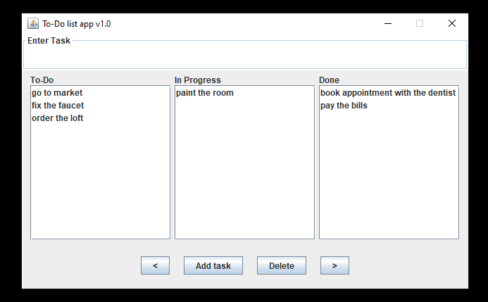

To-Do List App

This is a simple Java Swing application that allows you to manage your tasks in a to-do list. You can add new tasks, move them between different stages (To-Do, In Progress, and Done), and delete them. The user interface is divided into three panels, one for each stage of the tasks, and a button panel at the bottom with controls for adding, deleting, and moving tasks.

